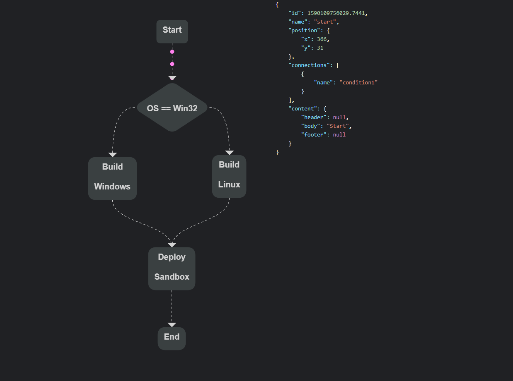

# Future Flow

This project aims to be a simple Flow generator using HTML5 Canvas.

[DEMO](https://naughty-dijkstra-92979d.netlify.app)



# Features

-   [x] Import Flow using JS Object or JSON
-   [x] Zoom
-   [x] Pan
-   [x] Customize Block layout using properties
-   [ ] Mobile Ready - In Progress
-   [ ] Customize Connections
-   [ ] Export Flow as JSON or JS Object
-   [ ] Allow creation of personalized Blocks
-   [ ] Export Flow as Image
-   [ ] Animations

# How to use

-   [Nuxtjs](#nuxtjs)
-   [Browser](#browser)

## Nuxtjs

First, install the package with npm

```terminal
npm i future-flow --save
```

Then in your Component

```html
<template>
    <div class="d-flex flex-column flex-grow-1 vh-100">
        <canvas id="canvas"></canvas>
    </div>
</template>

<script>
    import { Flow } from 'future-flow'
    export default {
        mounted() {
            const options = {
                background: {
                    color: 'rgb(255,255,255)',
                },
                fps: 60,
                zoom: {
                    level: 1,
                    max: 2,
                    min: 0.2,
                },
                isDebugging: false,
                drawOrigin: true,
                editor: false,
                canMoveBlocks: true,
                autoArrange: false,
            }

            const data = {
                start: {
                    x: 50,
                    y: 72,
                    isDraggable: false,
                    connections: ['stage1'],
                    background: {
                        color: '#12e445',
                    },
                    border: {
                        radius: 20,
                        padding: {
                            top: 50,
                            right: 50,
                            bottom: 50,
                            left: 50,
                        },
                        normal: {
                            width: 2,
                            color: 'transparent',
                        },
                        selected: {
                            width: 2,
                            color: 'black',
                        },
                        hover: {
                            width: 2,
                            color: 'black',
                        },
                    },
                    body: {
                        text: 'Start',
                        alignment: 'start',
                        divider: {
                            width: 1,
                            color: 'rgb(0,0,0)',
                        },
                        font: {
                            family: 'Arial',
                            style: 'normal',
                            variant: 'normal',
                            color: 'rgba(0,0,0,0.6)',
                            size: 20,
                            weight: 'bold',
                        },
                    },
                },
                stage1: {
                    x: 300,
                    y: 45,
                    isDraggable: true,
                    connections: ['end'],
                    border: {
                        radius: 20,
                        normal: {
                            width: 5,
                            color: 'rgba(0,0,0,0.2)',
                        },
                        selected: {
                            width: 2,
                            color: 'black',
                        },
                        hover: {
                            width: 2,
                            color: 'black',
                        },
                    },
                    header: {
                        text: 'Alert',
                        alignment: 'start',
                        font: {
                            family: 'Arial',
                            style: 'normal',
                            variant: 'normal',
                            color: 'rgba(0,0,0,0.6)',
                            size: 20,
                            weight: 'bold',
                        },
                        padding: {
                            top: 15,
                            left: 15,
                            right: 15,
                            bottom: 15,
                        },
                        divider: {
                            color: 'rgba(0,0,0,0.2)',
                            width: 2,
                        },
                    },
                    body: {
                        text: 'New Event Created',
                        alignment: 'start',
                        font: {
                            family: 'Arial',
                            style: 'normal',
                            variant: 'normal',
                            color: 'rgba(0,0,0,0.6)',
                            size: 20,
                            weight: 'bold',
                        },
                    },
                },
                end: {
                    x: 700,
                    y: 72,
                    isDraggable: true,
                    isConnectable: true,
                    canConnect: true,
                    background: {
                        color: 'rgb(255,0,0)',
                    },
                    border: {
                        radius: 20,
                        padding: {
                            top: 50,
                            right: 50,
                            bottom: 50,
                            left: 50,
                        },
                        normal: {
                            width: 2,
                            color: 'transparent',
                        },
                        selected: {
                            width: 2,
                            color: 'black',
                        },
                        hover: {
                            width: 2,
                            color: 'black',
                        },
                    },
                    body: {
                        text: 'End',
                        alignment: 'start',
                        font: {
                            family: 'Arial',
                            style: 'normal',
                            variant: 'normal',
                            color: 'rgba(0,0,0,0.6)',
                            size: 20,
                            weight: 'bold',
                        },
                    },
                },
            }

            // eslint-disable-next-line no-unused-vars
            const flow = new Flow({ options, data })
        },
    }
</script>

<style></style>
```

## Browser

Add a script tag poiting to npm CDN

```html
<script src="https://unpkg.com/future-flow@0.0.1-43/lib/index.min.js"></script>
```

Then just initialize the flow using an instance of `futureFlow.Flow({ options, data })`

```html
<html>
    <head>
        <script src="https://unpkg.com/future-flow@0.0.1-43/lib/index.min.js"></script>
    </head>
    <body>
        <canvas id="canvas"></canvas>
    </body>

    <script>
        const options = {
            background: {
                color: 'rgb(255,255,255)',
            },
            fps: 60,
            zoom: {
                level: 1,
                max: 2,
                min: 0.2,
            },
            isDebugging: false,
            drawOrigin: true,
            editor: false,
            canMoveBlocks: true,
            autoArrange: false,
        }

        const data = {
            start: {
                x: 50,
                y: 72,
                isDraggable: false,
                connections: ['stage1'],
                background: {
                    color: '#12e445',
                },
                border: {
                    radius: 20,
                    padding: {
                        top: 50,
                        right: 50,
                        bottom: 50,
                        left: 50,
                    },
                    normal: {
                        width: 2,
                        color: 'transparent',
                    },
                    selected: {
                        width: 2,
                        color: 'black',
                    },
                    hover: {
                        width: 2,
                        color: 'black',
                    },
                },
                body: {
                    text: 'Start',
                    alignment: 'start',
                    divider: {
                        width: 1,
                        color: 'rgb(0,0,0)',
                    },
                    font: {
                        family: 'Arial',
                        style: 'normal',
                        variant: 'normal',
                        color: 'rgba(0,0,0,0.6)',
                        size: 20,
                        weight: 'bold',
                    },
                },
            },
            stage1: {
                x: 300,
                y: 45,
                isDraggable: true,
                connections: ['end'],
                border: {
                    radius: 20,
                    normal: {
                        width: 5,
                        color: 'rgba(0,0,0,0.2)',
                    },
                    selected: {
                        width: 2,
                        color: 'black',
                    },
                    hover: {
                        width: 2,
                        color: 'black',
                    },
                },
                header: {
                    text: 'Alert',
                    alignment: 'start',
                    font: {
                        family: 'Arial',
                        style: 'normal',
                        variant: 'normal',
                        color: 'rgba(0,0,0,0.6)',
                        size: 20,
                        weight: 'bold',
                    },
                    padding: {
                        top: 15,
                        left: 15,
                        right: 15,
                        bottom: 15,
                    },
                    divider: {
                        color: 'rgba(0,0,0,0.2)',
                        width: 2,
                    },
                },
                body: {
                    text: 'New Event Created',
                    alignment: 'start',
                    font: {
                        family: 'Arial',
                        style: 'normal',
                        variant: 'normal',
                        color: 'rgba(0,0,0,0.6)',
                        size: 20,
                        weight: 'bold',
                    },
                },
            },
            end: {
                x: 700,
                y: 72,
                isDraggable: true,
                isConnectable: true,
                canConnect: true,
                background: {
                    color: 'rgb(255,0,0)',
                },
                border: {
                    radius: 20,
                    padding: {
                        top: 50,
                        right: 50,
                        bottom: 50,
                        left: 50,
                    },
                    normal: {
                        width: 2,
                        color: 'transparent',
                    },
                    selected: {
                        width: 2,
                        color: 'black',
                    },
                    hover: {
                        width: 2,
                        color: 'black',
                    },
                },
                body: {
                    text: 'End',
                    alignment: 'start',
                    font: {
                        family: 'Arial',
                        style: 'normal',
                        variant: 'normal',
                        color: 'rgba(0,0,0,0.6)',
                        size: 20,
                        weight: 'bold',
                    },
                },
            },
        }

        const flow = new futureFlow.Flow({
            options,
            data,
        })
    </script>
</html>
```

## Block Properties

When initializing Future Flow you have to pass the Options and Data JS Objects.
Inside the Data Object each key represents a block, and each value is the block's configuration.
The key is also the Name of the Block and it is used to create a Connection. In the example below, block "a" will
connect with blocks "b" and "c". If the block name written in the connections array does not exist, the connections won't be created.

```javascript
const data = {
    a: {
        x: 50,
        y: 50,
        isDraggable: true,
        connections: ['b', 'c'],
        background: {
            color: 'rgb(255,255,255)',
        },
        border: {
            radius: 10,
            normal: {
                width: 2,
                color: 'rgb(0,0,0,0.2)',
            },
            selected: {
                width: 2,
                color: 'black',
            },
            hover: {
                width: 2,
                color: 'black',
            },
        },
        shadow: {
            color: 'rgba(0,0,0,0.2)',
            blur: 6,
            offset: {
                x: 5,
                y: 5,
            },
        },
        header: {
            text: 'lor sit amet orci efficitur',
            alignment: 'start',
            divider: {
                width: 1,
                color: 'rgba(0,0,0,0.2)',
            },
            font: {
                family: 'Arial',
                style: 'normal',
                variant: 'normal',
                color: 'rgba(0,0,0,0.6)',
                size: 20,
                weight: 'bold',
            },
        },
        body: {
            text:
                'Lorem ipsum dolor sit amet, consectetur adipiscing elit. Praesent at consectetur lorem. Etiam dignissim dolor sit amet orci efficitur auctor.',
            alignment: 'start',
            divider: {
                width: 1,
                color: 'rgba(0,0,0,0.2)',
            },
            font: {
                family: 'Arial',
                style: 'normal',
                variant: 'normal',
                color: 'rgba(0,0,0,0.6)',
                size: 20,
                weight: 'bold',
            },
        },
        footer: {
            text: 'lor sit amet orci efficitur',
            alignment: 'start',
            divider: {
                width: 1,
                color: 'rgba(0,0,0,0.2)',
            },
            font: {
                family: 'Arial',
                style: 'normal',
                variant: 'normal',
                color: 'rgba(0,0,0,0.6)',
                size: 20,
                weight: 'bold',
            },
        },
    },
}
```

## Pictures


